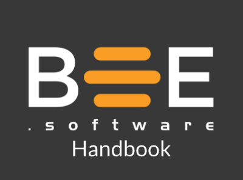

Le **Bee.Software Handbook** se veut être une boussole pour donner des repères aux abeilles.

Il cherche à 
- Capturer nos ententes de fonctionnement
- Conserver les précédents importants
- Fournir de la documentation utile
- Être en constante évolution
- Évoluer dans le temps

## Table des matières

[Introduction](./src/intro.md)

- [Bee](./src/ressources/bee.md)
  - [Objectif thématique](./src/ressources/objectif.md)
  - [Le Hive](./src/hive/hive.md)
  - [Outils](./src/ressources/outils.md)
  - [Routines](./src/ressources/routines.md)
  - [Pratiques](./src/ressources/pratiques.md) 
  - [Why Bee](./src/ressources/why_bee.md)
- [Fonctions](./src/fonctions.md)
    - [Gabarit d'écriture de fonctions](./src/fonctions/gabarit.md)
    - [Adopter un client](./src/fonctions/adopter_un_client.md)
    - [Butiner](./src/fonctions/butiner.md)
    - [Contribuer au hive](./src/fonctions/contribuer_au_hive.md)
    - [Intégrer une abeille](./src/fonctions/integrer_une_abeille.md) 
    - [Payer les employés](./src/fonctions/payer_employes.md)
    - [Porter un mandat](./src/fonctions/porter_un_mandat.md)
    - [Renouer](./src/fonctions/renouer.md)
    - [Remettre à zéro](./src/fonctions/remettre_a_zero.md)
    - [Robin des bois](./src/fonctions/robin_des_bois.md)
    - [S'absenter](./src/fonctions/sabsenter.md)
    - [Suivre un lead](./src/fonctions/suivre_un_lead.md)
    - [Tenir les livres](./src/fonctions/tenir_les_livres.md)
        
- [Ressources](./src/ressources)
  - [Administration](./src/ressources/administration/administration.md)
  - [Formation](./src/ressources/formation)
  - [Marketing](./src/ressources/marketing)
  - [Social](./src/ressources/social)

- [Projets](./src/projets.md)
    - [Proposer un projet(comment)](./src/hive.projets/proposer_un_projet.md)
    - [Coaching](./src/hive.projets/coaching.md)
    - Conférences
      - [Confoo 2021](./src/hive.projets/conferences/confoo_2021.md)
    - Formation
      - [JUG](./src/hive.projets/formation/jug.md)
      - [UQAM 2018](./src/hive.projets/formation/uqam.md)
    - Marketing
      - [Agile Tour 2019](./src/hive.projets/marketing/agile_tour.md)
      - [Socrates 2020](./src/hive.projets/marketing/socrates.md)
      - [SWAG 2018](./src/hive.projets/marketing/swag_2018.md)
    - [Pigeon](./src/hive.projets/pigeon.md) 
    - Social
      - [Party Noel](./src/hive.projets/social/party_noel.md)
      - [Team Building(hâche, dodgebow, etc.)](./src/hive.projets/social/team_building.md)
    - [Crédits RS-DE 2018](./hive.projets/rs_de_2018.md)
    - [Stages](./src/hive.projets/stages.md)
    - Outillage
      - [Soutien financier au pair programming](./src/hive.projets/outillage/pair_programming.md)

Pour y contribuer.  
Si vous n'avez pas les accès en écriture, demander à une abeille de vous inviter à rejoindre le GitHub 
> git clone git@github.com:bee-software/bee-software-handbook.git
 

[mdBook](https://rust-lang-nursery.github.io/mdBook/) est utilisé pour générer le livre à partir de fichiers Markdown.
