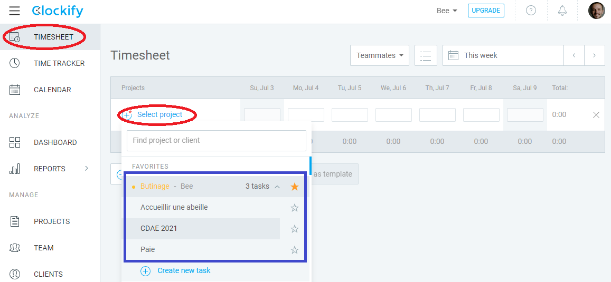
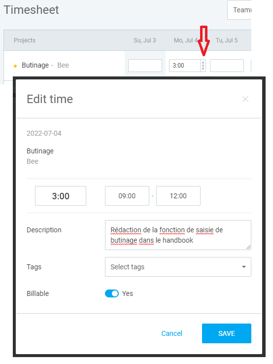

# Fonction - Saisir ses heures de butinage
### Service - ouverture
> Proposition de valeur
- TBD
### Outil - apte
> Programme, applications, liste de vérification, etc.
- [Clockify](https://app.clockify.me/)
### Préservation - convergence
> Solution en tant que création innovante
- TBD
### Action- motivé
> Penser dans un processus séquentiel et linéaire
- Dans Clockify, sélectionner le projet de Butinage. Vous pouvez utiliser/créer une tâche sous le projet butinage si le sujet du butinage a besoin d'un suivi plus précis 
- Après avoir saisi les heures dans la bonne case, décrire votre butinage en utilisant les 3 points verticaux de la case 
- Une abeille sous-traitante doit ajouter le montant associé à ce butinage à une facture suivant la date de saisie
- Une abeille employée n'a pas d'autre étape à réaliser

**Règle importante**: La compilation des heures de butinage à la comptabilité sera faite mensuellement, 10 jours après la fin du mois. La saisie de vos heures de butinage doit donc être faite dans les 10 jours suivant le mois de l'activité de butinage.
