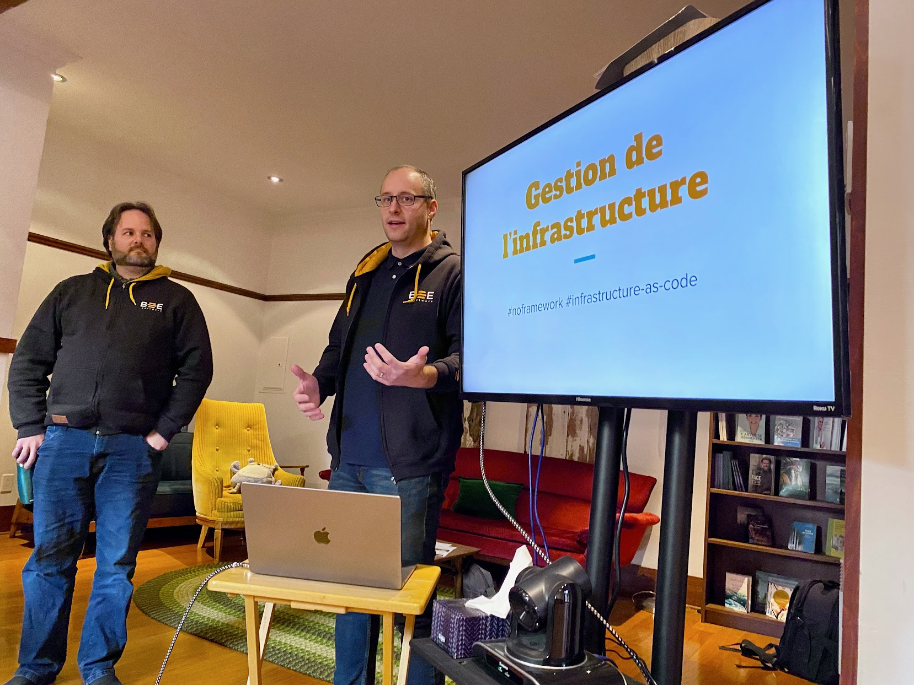

# Honeyconf 0.1 

### Proposition originale

- Conférence interne d’une journée, réservée aux abeilles

- Single-track. Relaxe, en famille

- 2 formats de présentations en alternance avec des pauses pour favoriser le dynamisme.

##### Objectifs :
- Avoir du fun en gang. Renouer. Rencontrer des abeilles. Partage de connaissance. Montée en compétences (présentateurs et auditoire).

- Donner la chance à des gens qui présentent moins d'essayer et fournir une plateforme à ceux qu'on a moins souvent la chance d' entendre.

- Mesurer l'intérêt et les possibilités de remettre des HoneyConf sous d'autres formats dans le futur 

### Porteurs
Vincent, Carl et Nicholas

### Financement du Hive

| Description                            |    Coûts |
|----------------------------------------|---------:|
| Organisation, etc.                     | 2287.50$ |
| Nourriture                             |     410$ |
| Local                                  |     125$ |
| -------------------------------------- |  ------- |
| Coût total                             |  2822.50 |

