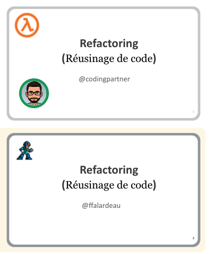

 

# Bee @UQAM

## Objectifs
- Redonner à un ancient collègue(Mathieu-Michel Coulombe)
- Redonner à notre ancienne université
- Donner aux abeilles impliquées une expérience de présentation dans ce type de contexte
- Faire rayonner les approches de développement logiciel que Bee favorise

## Porteurs
Nicholas Lemay, Francis Falardeau et Gabriel Rubenovitch

## Précédents créés
- 3 Formations gratuite offerte à des étudiant(e)s universitaires.
- Don par tirage de deux livres à des étudiants
- Utilisation du Hive pour compenser certains des efforts des 3 présentateurs.
- Tous les frais de repas(rencontre préparatoires, debriefs, etc.) avaient été aux frais des présentateurs.

### Financement du Hive
| Description      | Coûts |
| ----------- |  ---: |
| 5 * 500$      | 1500$       |
| Livres        | 62$
|  --------------------------------------   | -------       |
| Coût total   | 1562$        |

