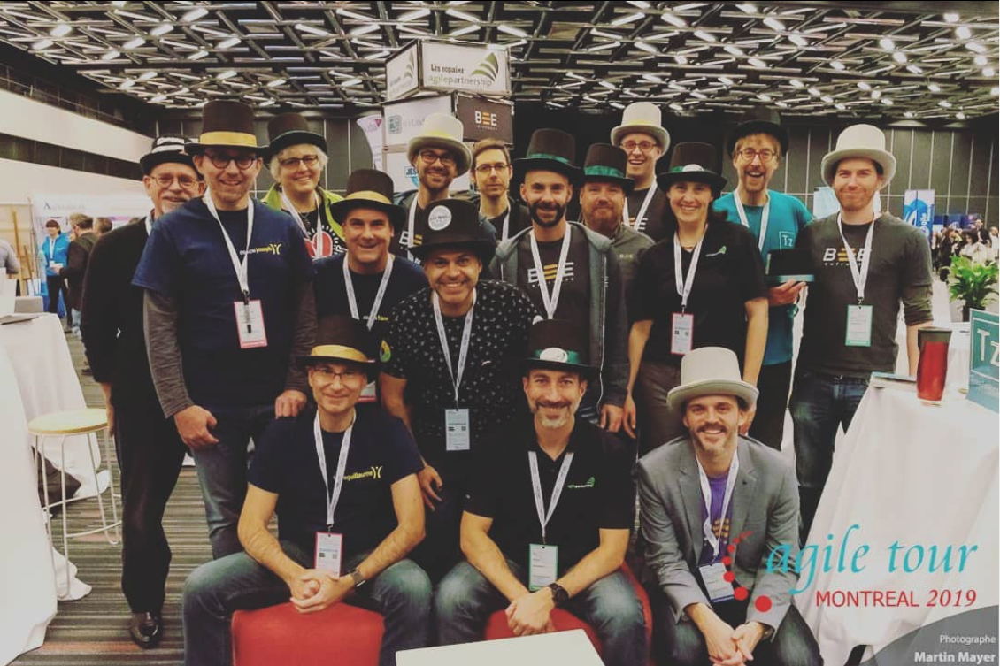

# Agile Tour 2019

## Aperçu
Le 28 novembre 2019, se tenait pour la 11e année consécutive l’Agile Tour Montréal. La plus grande conférence en son genre dans la région.

###Objectifs
- Permettre à ce type événement d'avoir lieu via notre commandite 
- (Re)Connecter avec des amis, ancients collègues, partenaires, etc.
- Se présenter comme un groupe
- Augmenter le sentiment d'unité du groupe

## Précédents pertinents
?

## Précédents créés
- Commandite d'un événement 
- Production de matériel promotionel
- Billets offerts aux abeilles participantes

## Porteur(s)
Luc Dorval

## Financement du Hive

| Description      | Coûts |
| :----------- |  ---: |
| Commandite     | 2079.52    |
| Billets     | 701    |
| Affiche     | 70    |
| Chapeaux     | 45    |
|  --------------------------------------   | -------       |
| Coût total   | ?        |

