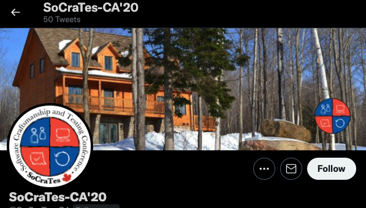

# Socrates Canada 2020

## Aperçu

Du 13 au 15 mars 2020, un événement de style retraite qui réunit des passionnés qui désirent échanger sur le développements logiciel. 

 
###Objectifs
- Permettre à ce type événement d'avoir lieu via notre commandite (Objectif primaire)
- Y contribuer notre expérience
- Apprendre des autres participants
- Faire connaître Bee dans ce cercle (Objectif secondaire)

## Précédents pertinents
[Agile Tour 2019 ](./agile_tour.md)

## Porteur(s)
Nicholas Lemay & François Perron

## Précédents créés
- Commandite d'un événement sans objectifs de visibilité
- Présence de Nicholas payée via la commandite
- François a défrayé sa présence

## Financement du Hive

| Description      | Coûts |
| :----------- |  ---: |
| Commandite     | 1501$       |
|  --------------------------------------   | -------       |
| Coût total   | 1501        |

