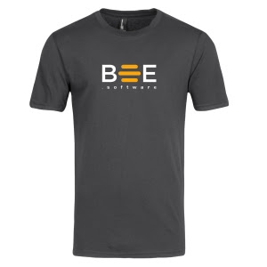

# Achat de Swag 2018 

## Aperçu et objectif
- Augmenter le sentiment d'appartenance des abeilles
- Mettre en valeur notre nouveau logo
- Cimenter l'existance de notre entreprise chez nos clients actuels

## Apprentissages
- Connaissance des longueurs possibles dans le processus de certains fournisseurs(chronophage)
- Chandails acheté via Vistaprint pour la facilité du processus
- La qualité d'impression n'a pas été au rendez-vous dans l'option à bas prix

## Porteur(s)
Nicholas Lemay (Chandails) 
Luc Dorval (Cartes)

## Précédents créés

- Chandails offerts gratuitments aux abeilles
- Chandails offerts gratuitement à certains clients

## Financement du Hive

| Description      | Coûts |
| :----------- |  ---: |
| Tshirt et chemise d'essaies      | 74.24$       |
| 18 chandails Hoodies   | 269$        |
| 12 Hoodies   | 408$        |
| Remboursement 12 Hoodies   | (408)        |
| 1 chemise   | 34$        |
|Commande pour les amis des abeilles|282.22|
|Commande subséquente(t-shirt mauve, Hoodies supplémentaires,etc.)|392.29|
|Cartes d'affaire|289$|
|  --------------------------------------   | -------       |
| Coût total   | ?        |

Les frais pour les démarches font l'objet d'une [remise à Zéro](../../fonctions/remettre_a_zero.md)

