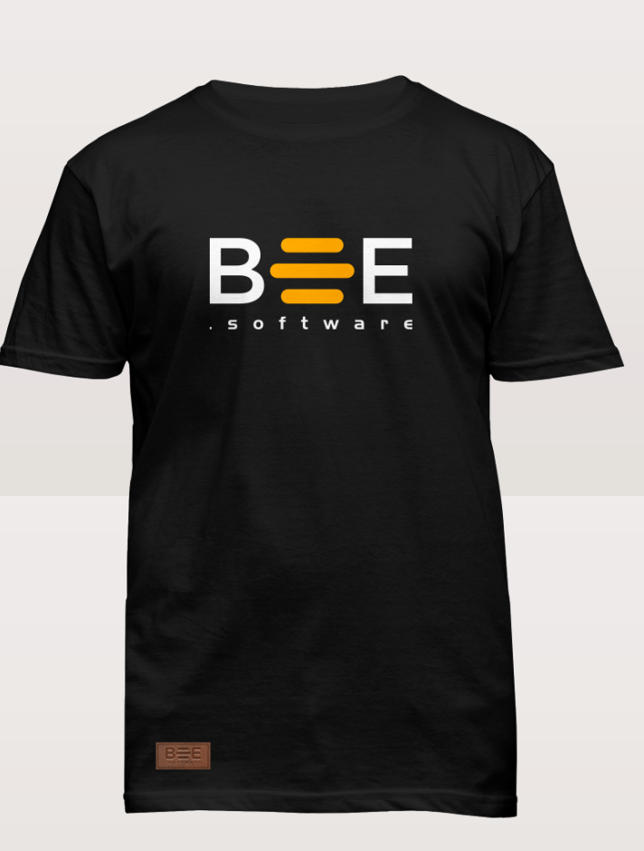

# Achat de Swag 2022

## Aperçu et objectif
- Augmenter le sentiment d'appartenance des abeilles
- Permettre aux nouvelles abeilles d'avoir accès au matériel
- Prévoir l'arrivée de nouvelles abeilles

## Apprentissages
- Processus de design accompagné de Unique Wool
- Délais de confirmer les design et tailles avec le groupe

## Porteur(s)
Nicholas Lemay 

## Précédents utiles 
Commande de [swag 2018](swag_2018.md)

## Précédents créés

- Travail avec un nouveau fournisseur(Unique wool)

## Financement du Hive

| Description      | Coûts |
| :----------- |  ---: |
| 50 * t-shirts     | 1000.00$       |
| 40 * hoodies   | 1840.00$        |
| Shipping   | 222.50$        |
| Taxes   | 425.39$        |
|  --------------------------------------   | -------       |
| Coût total   | 3487.89     |

Les frais pour les démarches font l'objet d'une [remise à Zéro](../../fonctions/remettre_a_zero.md)

