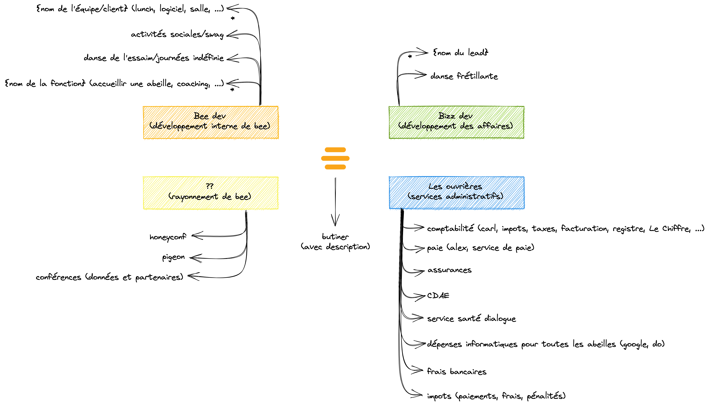

## Le Hive
Le hive permet à bee d'exister et de se réaliser.

### Contributions

Voir [Contribuer au hive](./src/fonctions/contribuer_au_hive.md)

### Utilisations

#### Dans clockify
Un project par axe. Une tâche par activité.

#### Dans xero

Categories comptables != catégories bee. 
Comment catégoriser les entrées dans les catégories comptables et dans les catégories bee?

Dépenses de bureau -> Honoraire professionnel?
- enquete certn
- https://go.xero.com/AccountsPayable/View.aspx?invoiceID=d9444e5d-0f12-4280-9309-34b1b1600d84

Dépenses de bureau -> Honoraire professionnel?
- dialogue

Dépenses informatiques
- ya quelques entrées que je ne comprends pas
- https://reporting.xero.com/!p3TRk/v1/Run?reportId=1eea47a0-1844-461b-b188-950eabb97527

Frais bancaires et Transactions fee
- les combiner?

Travail administratif
- à regarder ensemble
- https://reporting.xero.com/!p3TRk/v1/Run?reportId=1eea47a0-1844-461b-b188-950eabb97527
