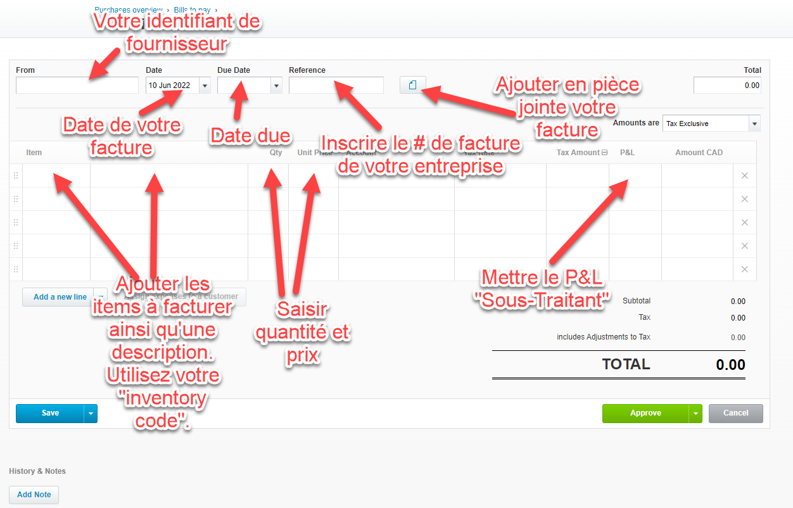

# Facturation

## Facturation du client

### Pré-requis
- Avoir accès à la facturation dans Xero (menu Business -> Invoices, rôle `Adviser`)*
- Avoir fait créer le client*
- Avoir fait créer votre un `ìnventory code` représentant (Employé ou Sous-Traitant)  
  ex: `Employé - John Doe` ou `Sous-Traitant - ABC inc`
- Avoir fait créer l'item de `tracking category P&L` pour l'employé (si applicable)
- Créer un répertoire `facturation` dans notre Google Drive* au nom du client sous  
  `_Public/Clients/[Nom du client]`

*Voir avec Carl

### Feuille de temps
Conserver une copie des heures à facturer dans notre Google Drive dans le répertoire de facturation du client

### Document pour le client
Les factures destinées au client peuvent être conservées dans notre Google Drive sous le répertoire facturation du client.  

Vous pouvez aussi vous contenter de l'association à votre facture client dans Xero. Voir [Création de la facture dans Xero](#Création-de-la-facture-dans-Xero).

### Template de facturation
TODO : Jonathan a fait un gabarit basé sur ce qui est dans Clockify
Vous pouvez vous inspirer des documents de facturation existant pour faire votre format de facture.

Bien que nous utilisons Xero pour faire la comptabilité, nous ne l'utilisons pas pour facturer le client directement dû à la séparation
entre ce qui va dans le Hive et ce qui revient à l'abeille

### Création de la facture dans Xero
1. Ouvrir Xero, menu Business -> Invoices
2. Click `New Invoice`
3. Entrer les informations, voir l'image suivante  
4. Ajouter une ligne pour le `Hive` pour chaque abeille que vous facturez  
5. Le résultat final devrait contenir au moins 1 ligne par abeille + 1 ligne de Hive
6. Attacher votre facture (celle que vous utilisez pour envoyer au client) à votre facture Xero  
7. Une fois terminé, vous devez soumettre votre facture pour approbation (voir image ci-dessus)
8. Vous devez envoyer votre facture au client en format PDF (pas besoin d'attendre l'approbation)

### Arrondissement
Il existe parfois un écart entre le montant facturé au client et celui de la facture dans Xero dû à la façon dont les taxes se calculent. 
Advenant un écart, vous devez ajouter une ligne dans votre facture Xero pour balancer les montants.

Pour balancer votre facture, vous devez ajouter une ligne dans Xero qui vous servira à balancer le montant.
Voir l'image suivante  

## Facturation du fournisseur (Abeille sous-traitante)
### Pré-requis
- Avoir accès à la facturation dans Xero (menu Business -> Bills to pay)*
- Avoir fait créer le fournisseur*
- Avoir fait créer votre un `ìnventory code` représentant (Sous-Traitant)* 
  ex: `Sous-Traitant - ABC inc`

*Voir avec Carl

### Création de la facture à payer dans Xero
1. Ouvrir Xero, menu Business -> Bills to pay
2. Click `New Bill`
3. Inscrire les informations requises. Voir image suivante  
4. Idéalement, dans la facture de votre entreprise, référé la facture client qui est visée dans une description ou en référence
5. Une fois terminée, soumettre de votre facture pour approbation