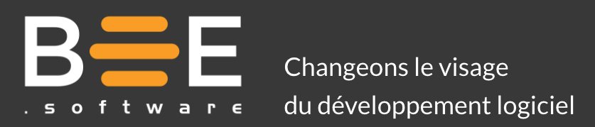

## Raison d’être
> Pourquoi on existe ?

Changer le visage du développement logiciel au Québec.

### Raison d'être - En détails

Changer le visage du développement logiciel au Québec en offrant une expérience différente, professionnelle et complète, axée sur l’engagement, la performance et l’excellence. Produire des logiciels que nos clients adorent et qui nous rendent fiers.

## Valeurs
>Comment on se comporte ?

### Valeurs coeur
>Les valeurs vécues par le groupe (max 10)

Ouverture, plaisir, engagement, collaboration, pérennité, responsabilisation, collectif, entraînement, maîtrise.

### Valeurs cardinales
>Les valeurs sur lesquelles on porte une attention particulière en ce moment ? (Max 4)

Engagement, plaisir, collaboration

### Valeurs aspirationnelles
>Quelles sont les valeurs auxquelles on aspire? 
 
Sagesse, harmonie

## 3 Piliers
>Comment on réussit à avoir du succès à réaliser notre raison d’être ?

Passion, Qualité, Expérience

## Activités
>Les principales choses qu’on fait ?

- Développement de logiciel sur mesure
- Accompagnement/conseil auprès d’équipes de développement
- Formation à des équipes de développement	

