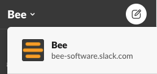

# Outils

Outil principal de communication et de prise de décisions des abeilles.

- Annonces

  - [Abscence d'une abeille](../fonctions/sabsenter.md)
  - Arrivée/[intégration d'une abeille](../fonctions/integrer_une_abeille.md)
  - Départ d'une abeille
    
- Social
  - Organisation d'événements(party, poker, etc.)

- Prise de décision à distance
  - [Proposer un projet](../hive.projets/proposer_un_projet.md)
  - Supporter, commenter, décliner, une proposition
  - 
    
- Précédents
  - Communiquer la création de précédents pertinents d'utilisations du Hive pour faciliter les [propositions futures](../hive.projets/proposer_un_projet.md)

##Discord

Nous avons créé des serveurs pour plusieurs de nos clients(ex: GCR). Nous avons un serveur Bee pour les trucs généraux. Bon endroit pour une #pause-café.

# 

L’abonnement à Dialog permet aux abeilles inscrites (et leur famille) d’utiliser les forfaits de soins primaires et de soutien à la santé mentale.
Voir le canal #dialogue-app de [Slack](https://bee-software.slack.com/) pour plus de détails.

# 

[Xero](https://www.xero.com/ca/) est le logiciel comptable de BEE. Toutes les transactions de Bee doivent y figurer.
Par exemple: la gestion du Hive, les factures de fournisseurs, les factures clients, les paiements, les versements de salaires, etc.

[Trello](https://trello.com/b/qHuybh1J/bee) outil de planification, documentation des initiatives en cours ou à venir de Bee.

# Bee-Bee-O-Theque
Liste de livres disponibles gratuitement pour toutes les abeilles. 
En faire la demande ou le partage sur Slack.
La majorité des livres physiques sont chez Nicholas Lemay.

